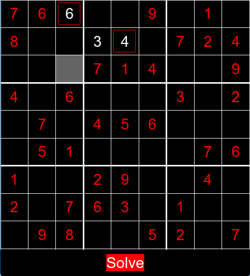
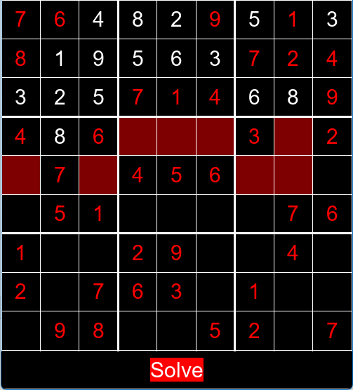
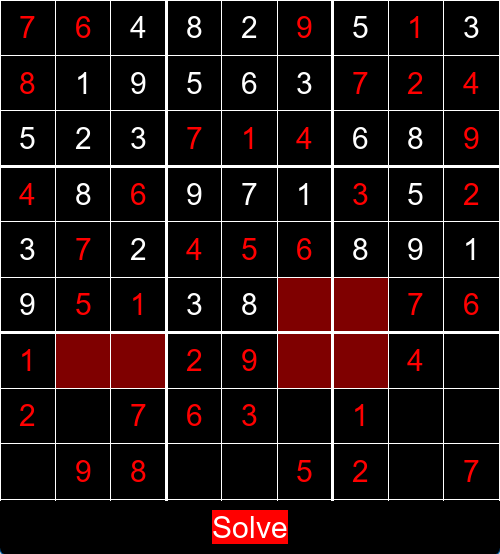
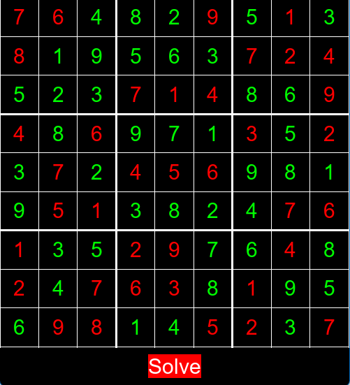

# Visual_Sudoku_Solver

Coded in Python utilizing PyGame

Try on Replit.com
https://replit.com/@peaceHH/Sukoku-Solver#main.py

## Error Highlighting

Highlights any squares where an invalid nubmer is entered with a red border

## Solver

Interactive display shows the computer solving the board utilizing a backtracking algorithm. Backtracked sqares are colored red

Beginning | Middle | Solved
:-------------------------:|:-------------------------:|:-------------------------:
 |  |  

